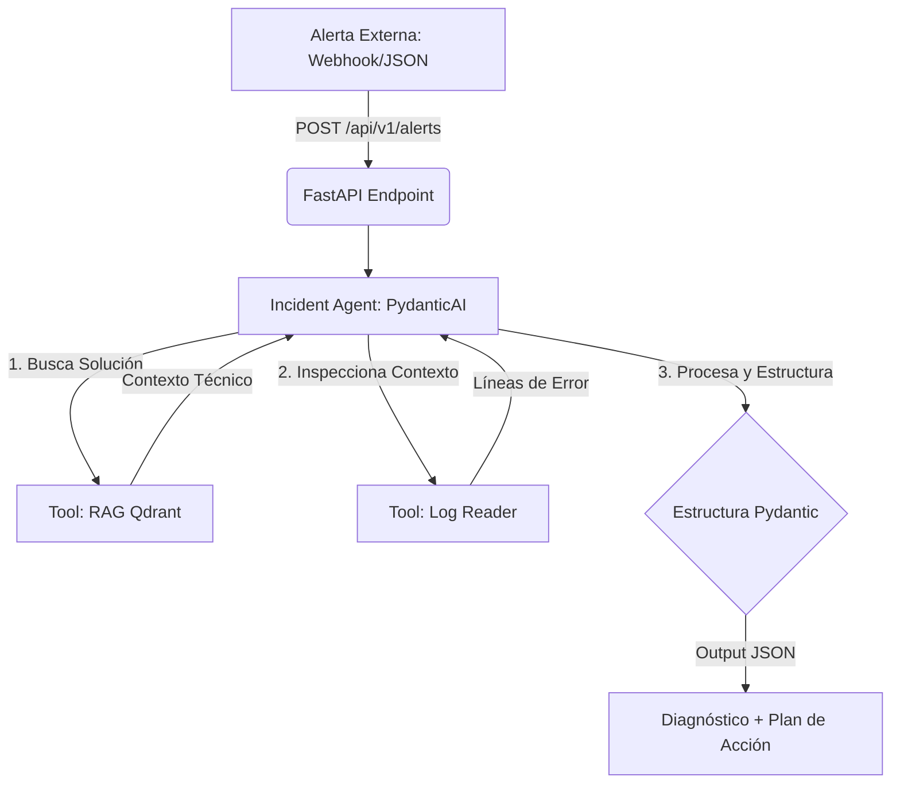

# On-Call AI Incident Responder 🚨

Un agente autónomo de Inteligencia Artificial diseñado para asistir a ingenieros de software y equipos de operaciones durante guardias 24x7, automatizando el triaje, la búsqueda de soluciones y la mitigación de incidencias críticas en producción.

---

## 📊 Arquitectura del Sistema

---

## 🛠️ Stack Tecnológico
Lenguaje Principal: Python 3.11+

**Framework API:** FastAPI (Diseño de endpoints asíncronos y documentación interactiva nativa con Swagger)

**Orquestación de Agentes:** PydanticAI (Framework de agentes de producción con tipado estricto y salidas estructuradas)

**Base de Datos Vectorial:** Qdrant (Instancia en memoria local para almacenamiento de embeddings y RAG rápido sobre playbooks)

**Modelos de Lenguaje:** Google Gemini / OpenAI (A través de APIs estándar)

---

## 🚀 Características Principales
Ingesta Automatizada: Endpoint preparado para recibir alertas en formato JSON (compatible con webhooks de herramientas de monitorización como Datadog o Grafana).

Razonamiento Multi-Paso: El agente decide de forma autónoma cuándo consultar los manuales internos (RAG) o cuándo inspeccionar directamente los archivos de logs del sistema afectado.

Respuesta Estructurada Garantizada: Mediante la validación con Pydantic, el output final siempre mantiene un esquema rígido que incluye la gravedad del incidente, los pasos de mitigación inmediatos y un borrador de reporte listo para enviar.

---

## 🔧 Instalación y Uso
(Próximamente...)