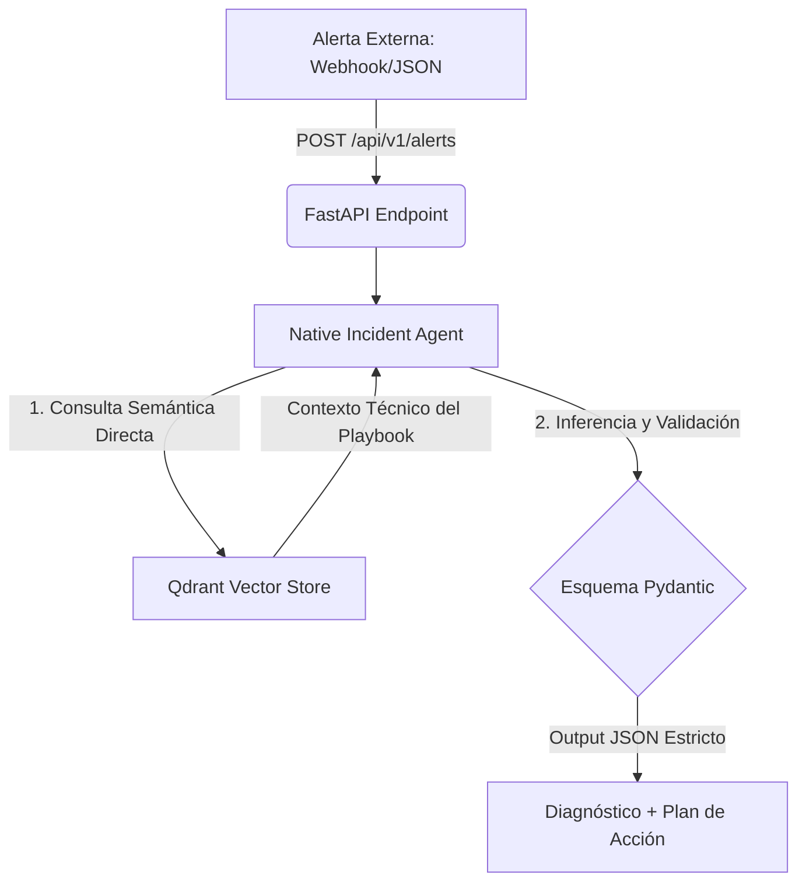

# On-Call AI Incident Responder 🚨

Un agente autónomo de Inteligencia Artificial diseñado para asistir a ingenieros de software y equipos de operaciones durante guardias 24x7, automatizando el triaje, la búsqueda de soluciones y la mitigación de incidencias críticas en producción.

---

## 📊 Arquitectura del Sistema



---

## 🛠️ Stack Tecnológico

### Lenguaje Principal
- Python 3.11+

### Framework API
- FastAPI
  - Diseño de endpoints asíncronos
  - Documentación interactiva nativa mediante Swagger UI

### Orquestación de IA
- Google GenAI SDK
  - Integración nativa con modelos masivos mediante `genai.Client`

### Validación de Datos
- Pydantic V2
  - Garantía de tipado estricto
  - Estructuración de respuestas JSON

### Base de Datos Vectorial
- Qdrant
  - Instancia local para almacenamiento de embeddings
  - Inyección RAG en tiempo de ejecución

### Modelos de Lenguaje
- Google Gemini 2.5 Flash

---

## 🚀 Características Principales

### Ingesta Automatizada
Endpoint preparado para recibir alertas en formato JSON, compatible con webhooks de herramientas de monitorización como:

- Datadog
- Grafana
- Keycloak

### Indexación en Tiempo de Ciclo de Vida (Lifespan)
Los manuales de contingencia e ingeniería en formato Markdown se procesan, vectorizan e indexan automáticamente en Qdrant durante el arranque del servidor web.

### Contextualización Inteligente (RAG)
El agente recupera en milisegundos las soluciones más relevantes del playbook asociadas semánticamente a la alerta recibida.

### Respuesta Estructurada Garantizada
Gracias a la validación mediante esquemas Pydantic, todas las respuestas HTTP mantienen una estructura rígida y predecible que incluye:

- Nivel de gravedad
- Análisis de causa raíz
- Pasos ordenados de mitigación
- Indicador de escalado (`escalate`)
- Resumen formateado para Slack

---

## 🔧 Instalación y Uso

### 1. Clonar el repositorio y configurar el entorno

```bash
git clone <url-de-tu-repo>
cd on-call-ai-responder

python -m venv .venv

# Windows (PowerShell)
.venv\Scripts\Activate.ps1

# Linux / macOS / Git Bash
source .venv/bin/activate

pip install -r requirements.txt
```

---

### 2. Configurar Variables de Entorno

Crear un archivo `.env` en la raíz del proyecto:

```env
PROJECT_NAME="On-Call AI Incident Responder"
VERSION="1.0.0"
API_V1_STR="/api/v1"
GEMINI_API_KEY="tu_api_key_de_google_ai_studio"
```

---

### 3. Ejecutar los Tests del Pipeline (RAG + Agent)

Para validar de forma aislada el motor vectorial y el agente de IA:

```bash
python -m tests.test_vector_store
```

---

### 4. Arrancar el Servidor Web

```bash
uvicorn app.main:app --reload
```

Accede a la documentación interactiva:

```text
http://127.0.0.1:8000/docs
```

---

## 🎯 Próximos Pasos (Roadmap)

### Fase 4 — Dockerización Enterprise
- [ ] Empaquetar la aplicación mediante `Dockerfile` y `docker-compose.yml`
- [ ] Garantizar despliegue reproducible y portabilidad completa

### Fase 5 — Automatización de Pruebas Unitarias
- [ ] Implementar suite de pruebas con `pytest`
- [ ] Validar endpoints HTTP mediante `httpx.AsyncClient`
- [ ] Integración continua para ejecución automática de tests

### Fase 6 — Integración de Canales de Notificación
- [ ] Integrar Slack
- [ ] Integrar Microsoft Teams
- [ ] Envío automático de alertas estructuradas y planes de mitigación

---

## 📄 Licencia

Este proyecto puede distribuirse bajo la licencia que mejor se adapte a las necesidades de tu organización. Se recomienda utilizar una licencia estándar de código abierto como MIT o Apache 2.0.

---

## 🤝 Contribuciones

Las contribuciones son bienvenidas.

1. Haz un fork del proyecto.
2. Crea una rama para tu funcionalidad:

```bash
git checkout -b feature/nueva-funcionalidad
```

3. Realiza tus cambios y haz commit:

```bash
git commit -m "feat: añadir nueva funcionalidad"
```

4. Envía tus cambios:

```bash
git push origin feature/nueva-funcionalidad
```

5. Abre un Pull Request.
